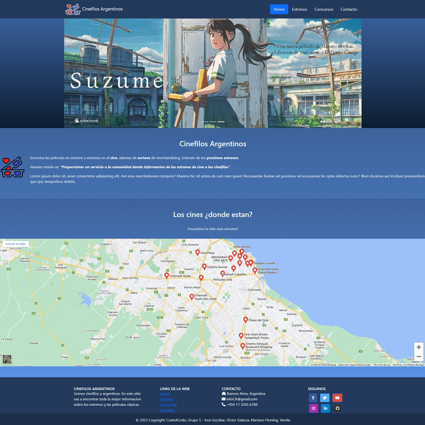

# 🎬Cinefilos Argentinos

Esta es una página web que ofrece una serie de funcionalidades para los usuarios interesados en conocer las películas en estreno y los cines cercanos en los que se proyectan.

Consta de 4 paginas webs (home, estrenos, concursos y contacto). Sus funciones estan descriptas en el apartado del mismo nombre.

## ❇️ Caracteristicas Principales

✅Presentacion: breve introduccion de la finalidad y uso de la pagina

✅Mapa de ubicación de cines: la página principal cuenta con un mapa interactivo en el que los usuarios pueden buscar cines cercanos y obtener información sobre las películas que se proyectan en ellos.

✅Películas: se incluye una página dedicada a la navegación de películas en estreno por medio de tarjetas que permite ver las opciones disponibles.

✅Formulario de concurso: se ha implementado un formulario que permite a los usuarios participar en un concurso relacionado con las películas en estreno.

✅Formulario de consultas: también se ha incluido un formulario de consultas para que los usuarios puedan contactar al equipo de soporte en caso de tener dudas o preguntas.

✅Medias query: Todas las páginas están diseñadas para ser responsivas y adaptarse a distintos dispositivos, desde computadoras de escritorio hasta dispositivos móviles. 
## 💾Tecnologías utilizadas

## 🎨Paleta de colores 
| Color  |Hex       |
| ------ |--------- |
| | `#3D639C`|
| | `#243A5C`|
| | `#568BDB`|
| | `#5A93E8`|
| | `#4C7BC2`|
| | `#F0F8FF`|
| ⬜| `#ffffff`|
| | `#000000`|

## 🗃️Funciones
En la pagina encontrara distintas animaciones y transformaciónes. A continuación se describen las acciones principales de cada página:

__🏠Página de inicio__

La página de inicio de la web cuenta con un carusel perpetuo que muestra imágenes de las películas más destacadas. Además, cuenta con enlaces de navegación a las otras páginas de la web. También incluye un mapa interactivo que te permite buscar los cines mas cercanos.

__🌠Página de estrenos__

La página de estrenos cuenta tarjetas de películas con su respectiva sinopsis y fecha de estreno, las cuales tienen una leve transformacion al posar el cursor sobre ellas. Esta página también cuenta con un enlace a un video de resumen, modificado para que inicie su reproduccion en el momento deseado.

__🏆Página de concursos__

La página de concursos cuenta con un formulario que debes completar para participar en los concursos de la página web. El formulario cuenta con reglas de completado, y el botón de enviar tiene una animación cuando se posiciona el cursor sobre él. Además, esta página incluye títulos con efecto de transición y descripción del sorteo.

__📧Página de contacto__

La página de contacto cuenta con un formulario que te permite enviar un mensaje al equipo de la página web. Además, incluye favicons que te permiten redirigirte a páginas de social-media de la página web.

__📓Generales__

Todas las páginas enlazadas de la página web cuentan con un footer que incluye información sobre la empresa, los enlaces a las redes sociales y los derechos de autor. Además, en la navegación se incluyen los mismos enlaces para redirigirnos dentro de nuestra web.
Los formularios de las paginas concursos y contacto, están diseñados para recopilar información específica del usuario y enviarla a través de una **API** externa.

### Servicio de API

**Formspree.io** es un servicio de procesamiento de formularios en línea que se encarga de enviar los datos recopilados del formulario a una dirección de correo electrónico específica en forma de correo electrónico. 
Cuando un usuario completa y envía un formulario de contacto o de concursos, los datos del formulario se recopilan y se envían automáticamente a través de la API Formspree.io.

Una vez que se han enviado los datos del formulario, Formspree.io los procesa y los envía al correo electrónico designado. Esto permite que los propietarios de la página web reciban los datos del formulario y los utilicen para ponerse en contacto con los usuarios o para utilizarlos en otros fines.

De esta manera, los usuarios pueden estar seguros de que los datos que proporcionan a través de los formularios de contacto y concursos se procesan de manera segura y se envían a la dirección de correo electrónico correspondiente para su procesamiento adicional.
## Demo

distintas capturas de la pagina 

